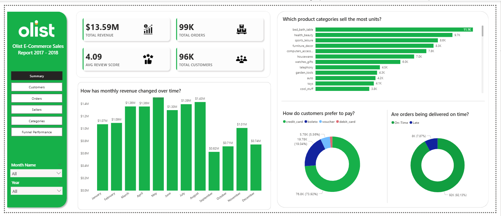

# Olist End-to-End E-Commerce & Marketing Analytics

An end-to-end analytics project built on the **Olist Brazilian E-Commerce and Marketing Funnel datasets**, covering the complete workflow from **raw data ingestion -> analytical modeling -> SQL insights -> Power BI dashboards**.

This project demonstrates how real-world analytics teams design data models, validate data, derive insights, and communicate results through interactive dashboards.

---

## Business Context & Objectives

Olist is a Brazilian e-commerce platform connecting sellers and customers across multiple categories.

The objective of this project is to analyze:

- Overall **e-commerce performance**
- **Customer and seller behavior**
- **Product and category trends**
- **Order fulfillment and delivery performance**
- **Marketing funnel effectiveness** (MQL -> closed sellers)
- **Revenue quality of acquired sellers**

The project is structured to reflect how analytics work is performed in production environments.

---

## Dataset Overview

This project uses publicly available datasets from Kaggle, spanning **two analytical domains**:

- **Transactional E-Commerce Data**  
- **CRM-Style Marketing Funnel Data**  

Detailed dataset descriptions and source links are documented in:
-> `02_data_sources/`

### Domains Covered

**E-Commerce Transactions**
- Customers
- Orders
- Sellers
- Products 
- Categories
- Payments
- Reviews

**Marketing Funnel**
- Marketing Qualified Leads (MQLs)
- Closed Deals (seller acquisition outcomes)

The dataset intentionally combines **transactional e-commerce data** with **CRM-style marketing funnel data**, enabling both **operational analytics** and **growth-focused funnel analysis**.

---

## Project Architecture

The repository is organized to mirror a real-world analytics workflow:

- **01_project_overview**  
  Business context, problem framing, and analytical objectives

- **02_data_sources**  
  Dataset scope, source tables, and data lineage documentation

- **03_ddl_table_creation**  
  Staging and analytical table definitions (schema design)

- **04_dml_data_load**  
  Data ingestion and controlled transformation logic

- **05_data_validation**  
  Data quality checks, integrity validation, and sanity tests

- **06_star_schema**  
  Analytical data models  
  - Star schema for e-commerce transactions  
  - Funnel-based logical model for marketing data

- **07_Analytical_Insights**  
  SQL-driven business analysis and metric derivation

- **08_power_bi_dashboard**  
  Interactive Power BI dashboards and supporting screenshots
  
Each folder represents a logical stage in the analytics lifecycle, from raw data to final insights.

---

## Data Modeling Strategy

### 1. E-Commerce Analytics - Star Schema

Transactional e-commerce data is modeled using a **star schema** to support fast querying and BI consumption.

- **Fact table:** `Fact_Order_Items` (item-level grain)
- **Dimension tables:** Customers, Products, Sellers, Orders, Payments, Reviews, Geolocation, Category Translation

This model enables:
- Revenue and GMV analysis
- Delivery performance tracking
- Product & seller performance ranking
- Customer behavior analysis

 Documentation:  
-> `06_star_schema/ecommerce/ecommerce_star_schema.md`

---

### 2.  Marketing Funnel Analytics - Event-Based Funnel Model

Marketing data is **intentionally NOT star-modeled**.

Instead, it uses an **event-based funnel design**, reflecting real CRM and growth analytics practices.

**Core tables:**
- `marketing_qualified_leads` (top of funnel)
- `marketing_closed_deals` (bottom of funnel)

These tables are linked via `mql_id` and analyzed through controlled joins.

This approach supports:
- Funnel drop-off analysis
- Conversion rate calculations
- Lead origin effectiveness
- Seller acquisition quality evaluation

 Documentation:  
-> `06_star_schema/marketing/marketing_data_model.md`

-> Knowing **when not to use a star schema** is as important as knowing how to design one.

---

## Analytical Insights (SQL)

All business insights are derived using SQL queries written on top of the analytical models.

Key questions answered include:

- How many MQLs convert into sellers?
- Which lead origins convert most effectively?
- Which channels bring higher-value sellers?
- How does seller quality vary by business type?
- What are the revenue and fulfillment characteristics of acquired sellers?

### SQL analysis:  
-> `07_Analytical_Insights/`

---

## Power BI Dashboards

Interactive dashboards were built in **Power BI Desktop**, using validated analytical tables and DAX measures.

->  Power BI (.pbix) download links are documented inside `08_power_bi_dashboard/`.

### 1.  E-Commerce Performance Dashboard

- 5-page interactive dashboard
- Covers customers, orders, sellers, products, and categories
- Built on star schema analytical model

**Preview (Summary Page):**

-> [View full E-Commerce dashboard screenshots](08_power_bi_dashboard/screenshots/ecommerce/)

---

### 2.  Marketing Funnel Performance Dashboard

- End-to-end seller acquisition funnel
- MQL -> Closed deal conversion
- Lead origin performance
- Revenue quality of acquired sellers

-> [View Marketing Funnel dashboard screenshot](08_power_bi_dashboard/screenshots/marketing/)

---

## Tools & Skills Demonstrated

- SQL (PostgreSQL)
- Data modeling (Star schema & funnel modeling)
- Data validation & quality checks
- Analytical problem solving
- Power BI Desktop
- DAX measures
- Business-driven dashboard design

---

## Key Takeaways

This project demonstrates:

- End-to-end ownership of an analytics workflow
- Correct modeling decisions based on data behavior
- Ability to translate raw data into business insights
- Strong alignment with real-world analytics engineering practices

---

## Final Note

This project intentionally combines **technical rigor** with **business interpretation**, reflecting how analytics teams operate in production environments.

It is designed not just to show *what* was built, but *why* it was built that way.
